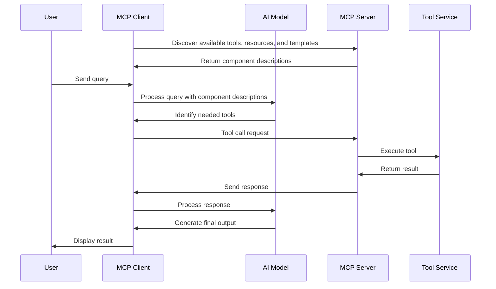

# Model Context Protocol (MCP)

## History and Evolution

### The Origins of Large Language Models

Large Language Models (LLMs) were initially designed with a singular purpose: to predict the next 
word or token in a sequence of text. This seemingly simple objective—training models on vast 
corpora of text to determine what word should follow a given sequence—formed the foundation 
of modern AI language capabilities.

As these models grew in size and were trained on increasingly diverse datasets, an unexpected 
side effect emerged. The models didn't just learn to predict the next token; they developed 
a form of "understanding" of language patterns, context, and even certain factual information 
embedded in their training data. This emergent capability allowed them to answer queries, 
write essays, and generate creative content—all as a byproduct of their primary training objective.

### Limitations of Traditional LLMs

Despite their impressive capabilities, modern LLMs face significant limitations:

1. **Knowledge Cut-off Dates**: LLMs have a "knowledge cut-off date"—they cannot access 
   information beyond the date of their last training data. This creates a temporal boundary 
   for their knowledge.

2. **Isolation from External Systems**: Traditional LLMs operate in isolation, unable to access 
   real-time information, databases, APIs, or other external systems. They can only work with 
   information provided in the prompt or learned during training.

3. **Context Window Constraints**: LLMs are limited by their context window—the amount of text 
   they can process at once—restricting their ability to work with large documents or maintain 
   long conversations.

### The RAG Approach

Retrieval-Augmented Generation (RAG) emerged as an initial solution to these limitations. RAG systems:

1. Retrieve relevant information from external knowledge bases
2. Augment the LLM's prompt with this retrieved information
3. Generate responses based on both the original query and the retrieved context

While RAG represented a significant advancement, it still had limitations:
- Retrieval quality heavily impacts response quality
- Limited to passive information retrieval rather than active tool use
- Often requires specialized vector databases and complex indexing
- Typically operates on a request-by-request basis without maintaining state

### The MCP Solution

The Model Context Protocol (MCP) represents the next evolution beyond RAG, addressing many of its limitations:

1. **Active Tool Usage**: Unlike RAG, which primarily retrieves information, MCP enables LLMs 
   to actively use tools and services, allowing them to perform actions rather than just 
   access information.

2. **Standardized Protocol**: MCP provides a consistent interface for tool discovery and usage, 
   eliminating the need for custom integrations for each new tool.

3. **Real-time Interaction**: MCP facilitates real-time, bidirectional communication between 
   LLMs and external systems, enabling more dynamic and interactive applications.

4. **Extensibility**: New tools can be added to MCP servers without modifying clients, 
   allowing for continuous expansion of capabilities.

5. **Stateful Operations**: MCP can maintain state across interactions, enabling more complex 
   workflows and multi-step processes.

By addressing these limitations, MCP enables a new generation of AI applications that can 
interact with the world in more meaningful and practical ways.

## MCP Clients

MCP clients are applications that connect to MCP servers to access tools and services. They typically:

1. **Discover available tools**: Clients can query MCP servers to discover what tools are available.
2. **Send requests**: Clients send requests to servers, often in natural language, which are then 
   processed by the server.
3. **Process responses**: Clients receive and process responses from the server, which may include 
   data, actions, or other information.
4. **Integrate with AI models**: Many MCP clients integrate with AI models (like OpenAI's GPT models) 
   to process natural language queries and generate appropriate tool calls.

## MCP Servers

MCP servers expose tools and services that can be accessed by MCP clients. They typically:

1. **Register tools**: Servers register tools that clients can discover and use.
2. **Process tool calls**: Servers receive tool calls from clients and execute the appropriate 
   actions.
3. **Return results**: Servers return the results of tool calls to clients.
4. **Manage connections**: Servers manage connections with clients, often using protocols like 
   HTTP and SSE.

MCP servers provide three main components:

1. **Resources**: Static data that can be accessed by clients. Resources represent information 
   that doesn't change frequently and can be retrieved without causing side effects. Examples 
   include documentation, reference data, or cached results.

2. **Tools**: Active components that perform operations and cause consequences when invoked. 
   Tools can modify data, interact with external systems, or perform computations. Tools are 
   the most common component in MCP implementations.

3. **Templates**: Predefined structures that streamline the prompt flow to LLMs. Templates help 
   standardize interactions with language models, ensuring consistent formatting and reducing 
   the need for repetitive prompt engineering. They can include placeholders for dynamic 
   content and instructions for how to process responses.

## Communication Flow

## The USB Adapter Analogy

The Model Context Protocol (MCP) can be understood through the analogy of a USB adapter:

**USB Adapter (MCP):**
- Just as a USB adapter provides a standardized interface for connecting various devices to a 
  computer, MCP provides a standardized protocol for connecting AI clients to various tools 
  and services.
- The USB standard defines how devices communicate, regardless of their specific function, 
  just as MCP defines how clients and servers communicate, regardless of the specific tools 
  they provide.

**Computer (MCP Client):**
- Like a computer that needs to connect to various peripherals, an MCP client needs to connect 
  to various tools and services.
- The computer doesn't need to know the internal workings of each peripheral, just how to 
  communicate with it through the USB interface. Similarly, an MCP client doesn't need to know 
  the internal workings of each tool, just how to communicate with it through the MCP protocol.

**Peripherals (MCP Server Tools):**
- Just as peripherals (like printers, keyboards, or external hard drives) provide specific 
  functionality to a computer through a USB connection, MCP server tools provide specific 
  functionality to an MCP client through the MCP protocol.
- Each peripheral has its own driver that translates the USB signals into actions specific to 
  that device. Similarly, each MCP tool has its own implementation that translates MCP requests 
  into actions specific to that tool.

**Plug-and-Play (Tool Discovery):**
- USB supports plug-and-play, allowing computers to automatically recognize and configure new 
  peripherals. Similarly, MCP supports tool discovery, allowing clients to automatically 
  discover and use new tools provided by servers.

This analogy helps illustrate how MCP provides a standardized way for AI applications to 
discover and utilize various tools and services, just as USB provides a standardized way for 
computers to connect to various peripherals.

## Benefits of MCP

1. **Standardization**: MCP provides a standard protocol for communication between AI clients 
   and tool-providing servers.
2. **Flexibility**: MCP allows clients to discover and use tools dynamically, without needing 
   to be hardcoded for specific tools.
3. **Scalability**: New tools can be added to MCP servers without requiring changes to clients.
4. **Interoperability**: Different clients and servers can work together as long as they follow 
   the MCP standard.
5. **Simplicity**: MCP abstracts away the complexity of tool implementation, allowing clients 
   to focus on their core functionality.
